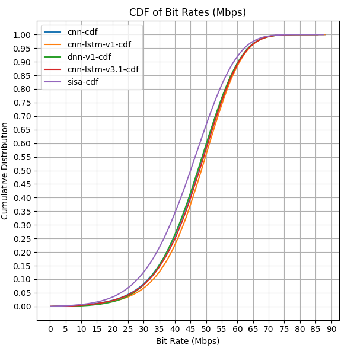

<div align="center">
  
</div>

<div align="center" style="width: 100%">
    <h2 style="color: #0594a9; font-weight: 500; font-size: 28px"> AI-Driven Radio Resource Management for Hyper-Dense 6G Networks </h2>
    <div style="width:100%; align: center; display: flex; gap: 12px;" markdown="1">
        <a href="https://opensource.org/licenses/MIT" style="margin-left: auto">
            
        </a>
        <a href="https://www.python.org/" style="">
            
        </a>
        <a href="https://wandb.ai/rubencid001/6GSmartRRM" style="margin-right: auto">
            
        </a>
    </div>
</div>

## Overview

6GSmartRRM is an AI/ML-driven project addressing the challenges of joint sub-band allocation and power control in hyper-dense 6G In-Factory subnetworks (InF-S). These subnetworks form the backbone of industrial automation systems, such as robotics, production modules, and conveyors, and face significant interference and resource management issues.

This project focuses on optimizing spectral efficiency, mitigating interference, and adapting to dynamic industrial environments using advanced AI techniques like deep learning and graph neural networks (GNNs).

## Challenge

This project is part of the [Radio Resource Management (RRM) for 6G in-X Subnetworks](https://challenge.aiforgood.itu.int/match/matchitem/97) Challenge from the [ITU AI/ML in 5G Challenge](https://challenge.aiforgood.itu.int/), which focuses on:

1. Tackling interference and resource allocation in hyper-dense industrial networks.
2. Developing AI-powered solutions for dynamic and mobile environments.
3. Ensuring high spectral efficiency and reliability in constrained radio frequency environments.

The project addresses the limitations of traditional radio resource management (RRM) methods and explores adaptive, scalable, and computationally efficient AI-based solutions for 6G In-Factory scenarios.

## Research & Findings

The proposed model (in the future) responds to a dynamic that we could not find a suitable solution
in the literature. After examining a series of publications, we were able to determine possible
actionable insights. We have summarize the findings in [bibliography documentation](./docs/baseline-comparison.md)

## Current Approaches
### Two-Step Control Problem

The first approach we are considering is the definition of a two-stage control system. The first stage will use a model to estimate
the optimal allocation while the second will set the power settings to reduce interference and increase the output.

In the following table, you can see the current results (they may not be updated, check the wandb link for updated results) for the first stage models / algoriths with the maximum power allocated (not yet done).

**Subband Allocation Results:**

| Algorithm / Model                           | Bit Rate (Mbps) | Spectral Efficency | Jain Fairness    | Proportional Factor Loss (%) |
|:-------------------------------------------:|:---------------:|:------------------:|:----------------:|:----------------------------:|
| SISA Algorithm (Baseline)                   | 44.04659        | 4.404659           | 0.9330245        |  **94.2641 %**               |
| Rate Confirming <br>(min-loss & FFN)        | 44.66844        | 4.466844           | 0.9417886        |  88.3355 %                   |
| Rate Confirming <br>(min-loss & CCN)        | 45.84627        | 4.584627           | 0.941231         |  88.5533 %                   |
| Rate Confirming <br>(min-loss & CNN + LSTM) | **47.32548**    | **4.732548**       | **0.949792**     |  88.0931 %                   |
| Rate Confirming <br>(min-loss & GNN)        | -    | -       | -     |  -                   |

For comparison and procedure, the results were obtained from the mean of 20.000 simulations of the networks. All metrics are itself the mean bit rate and metrics from each simulation between all subnetworks. This repo contains all tests and notebooks with code.

The following visualization compares the distribution of bit-rate results for all AP / subnetworks in the tests datasets based on the allocations
of the different models. For comparison, the lower the line the better the model performs.

<p align="center">
    
</p>

## Code Structure

The repository is organized into several key directories and files:

- **`docs/`** – Contains bibliographic references, comparisons between research papers, and potential ideas. Over time, this directory will be expanded with more information about discoveries and methods.
- **`g6smart/`** – A small library that provides evaluation methods (metrics), simulation information, and baseline implementations for both projects.
- **`notebooks/`** – Jupyter notebooks for experiments, analyses, and evaluations related to the project.
- **`.gitignore`** – Specifies files and directories that should be ignored by Git.
- **`config.ini`** – Configuration file for project settings.
- **`LICENSE`** – The project's licensing information.  It is MIT License.
- **`requirements.in` & `requirements.txt`** – Lists dependencies needed to run the project. we use [pip-tools](https://github.com/jazzband/pip-tools) to track used libraries.

The `data/simulations` directory is not uploaded to the repository, but it is expected to contain datasets used for experimentation and evaluation. It should contain
the files `.npy` with the simulation data.

## Installation
To install and run all code in the repository, all that is needs is to follow these steps:

1. Create environment
```bash
python -m venv venv
conda create -n venv
```

2. Install required packages
```bash
python -m pip install -r requirements.txt
```

3. If you are going to continue develop this repository, install pre-commit hooks
```bash
pip install pre-commit
pre-commit
```
